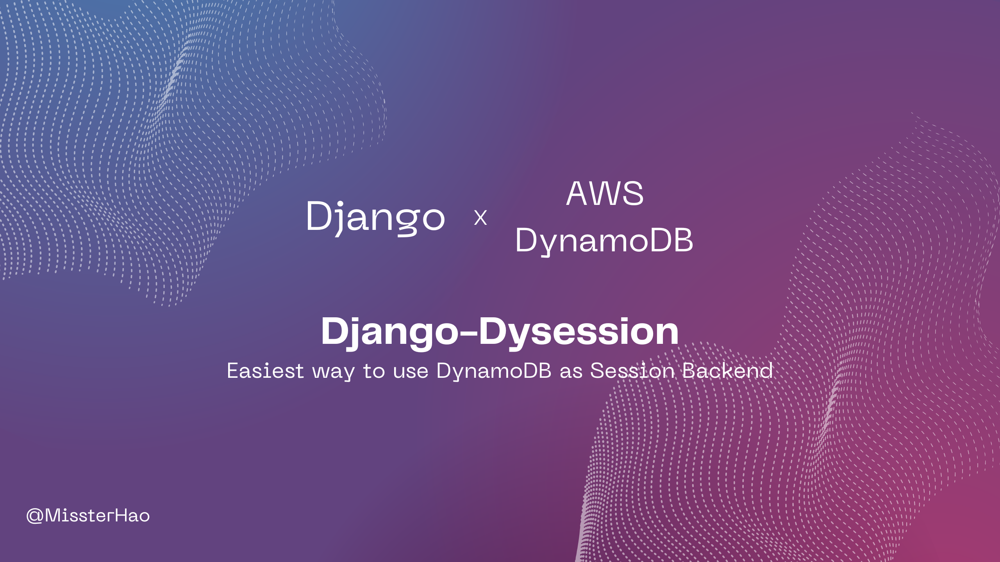
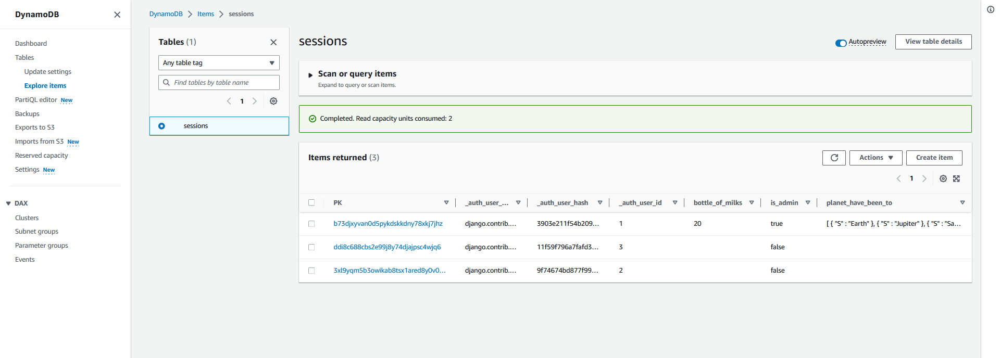

<div align="center">
<h1>django-dysession</h1>
<p>django-dysession is a django extension by using AWS DynamoDB as a session backend</p>

<!--  -->

<p align="center" >
<!-- First line -->
<a href="https://codecov.io/gh/MissterHao/django-dysession" style="margin-right: 8px;">

</a>
<a href="https://github.com/MissterHao/django-dysession">

</a>
<br>
<!-- Second line -->
<a href="https://github.com/MissterHao/django-dysession" style="margin-right: 8px;">

</a>
<a href="https://github.com/MissterHao/django-dysession" style="margin-right: 8px;">

</a>
<a href="https://github.com/MissterHao/django-dysession" style="margin-right: 8px;">

</a>
<br>
</p>
</div>


## What is a django-dysession?

Django-dysession is a simple and easy-to-use app which allow Django developers to take DyanmoDB as Session Backend Database.

DynamoDB is Fast, flexible NoSQL database service for single-digit millisecond performance at any scale.

Using DynamoDB for session storage alleviates issues that occur with session handling in a distributed web application by moving sessions off of the local file system and into a shared location. [[1]]

+ Easy to use! All you need is add two lines of Code!
+ Support ttl attribute
  Django's default session won't delete expired session data.
  By using DynamoDB, we can take advantage of DynamoDB's ttl attrubute to auto delete expired session data.
+ Taking advantage of AWS serverless service! ( No more effort to maintain and autoscale )


## Requirements
django-dysession use `boto3` to communicate with DynamoDB.
Boto3 is the Amazon Web Services (AWS) Software Development Kit (SDK) for Python, which allows Python developers to write software that makes use of services like **DynamoDB**.

+ Django >= 3.2
+ boto3 >= 1.26.59

## Installation

Install from PyPI ( or manually download from PyPI):
```bash
pip install django-dysession
```

## Getting Started
First of all, add `dysession` into `INSTALLED_APPS` in settings.py.
Change `SESSION_ENGINE` to `dysession.backends.db` in order use our SessionStore.
```python
INSTALLED_APPS = [
    ...
    "dysession", # add dysession to installed apps
    # 'django.contrib.sessions', # remove this default session
    ...
]

SESSION_ENGINE = "dysession.backends.db"
```

Second, we need to create a DynamoDB to store session data which's name is `sessions` as default.
Run the commands bellow in cmd.
```bash
python manage.py dysession_init
```

Then, we can enjoy it now!
```python
from django.http import HttpResponse

def mainpage(request):
    request.session["is_admin"] = True
    request.session["bottle_of_milks"] = 20
    request.session["planet_have_been_to"] = ["Earth", "Jupiter", "Saturn"]

    return HttpResponse("Ayyy")
```

Enjoy!




## Django Commands

django-dysession offer two commands for developers:
+ dysession_destory: Destory DynamoDB Table ( Will delete whole data of the table )
+ dysession_init: Create DyanmoDB Table

```bash
python manage.py --help

Type 'manage.py help <subcommand>' for help on a specific subcommand.

Available subcommands:

[dysession]
    dysession_destory
    dysession_init
```

## Settings

This section outlines all the settings and configurations that you can put in Django's settings.py to adjust `dysession`'s behavior.

You can overwrite any value in `DYSESSION` or just ignore it to use the default value!
```python
DYSESSION = {
    "DYNAMODB_TABLENAME": "sessions",
    "PARTITION_KEY_NAME": "PK",
    "SORT_KEY_NAME": "SK",
    "TTL_ATTRIBUTE_NAME": "ttl",
    "CACHE_PERIOD": 3600,
    "DYNAMODB_REGION": "ap-northeast-1",
}
```


| Argument           | Default        | Description                                                  |
| ------------------ | -------------- | ------------------------------------------------------------ |
| DYNAMODB_TABLENAME | sessions       | DynamoDB table name                                          |
| PARTITION_KEY_NAME | PK             | Partition key name                                           |
| TTL_ATTRIBUTE_NAME | ttl            | Time to live attribute name                                  |
| CACHE_PERIOD       | 3600           | Define how long should be the cache live in DynamoDB's table |
| DYNAMODB_REGION    | ap-northeast-1 | The region of the DynamoDB table                             |

